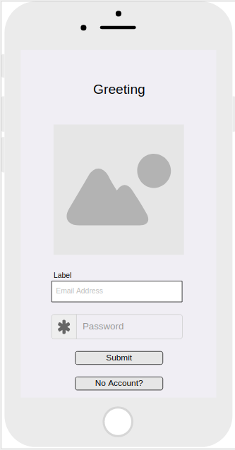
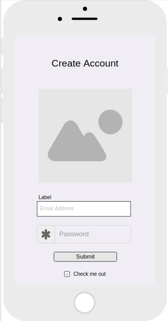
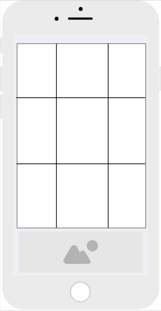
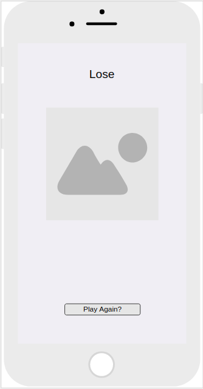
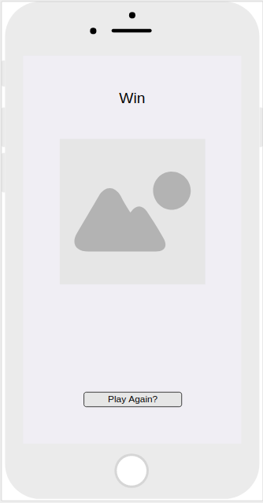
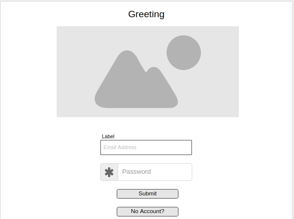
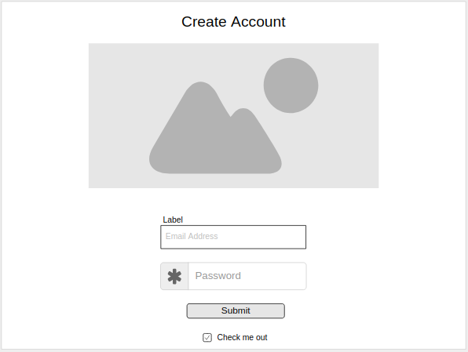
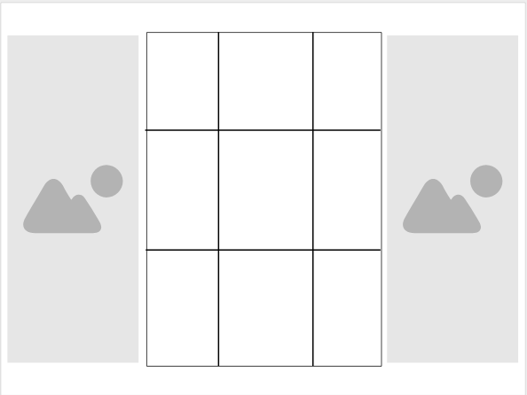
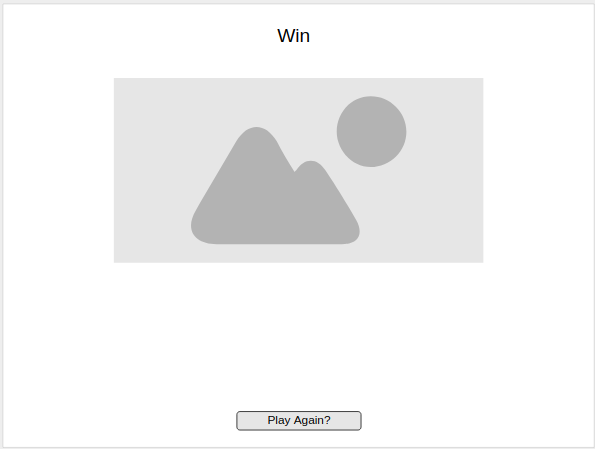

# Tic-Tac-Toe Client

A Tic-Tac-Toe Single-Page-Application with multiple views highlighting the basics of front-end web design and API integration.

## Goals of the Game/Project

1. Build a web application from scratch, without a starter codebase
1. Use programming skills to map out the game logic for a simple game like Tic Tac Toe
1. Separate HTML, CSS, and JavaScript files in the application
1. Build an application to a spec
1. Build a dynamic game that allows a user to play tic tac toe against themself
1. Crafted a readme.md file (this documentation)
1. Communicate with provided back-end to store the state of the game.
1. Work independantly to create the game.

## Technologies Used

1. html
2. CSS / sass
3. JavaScript
4. jQuery
5. API
6. Bootstrap
7. Problem Solving
8. Wireframes
9. User Stories
10. Markup documentation

### Development Process and Problem Solving Strategies

The first night of the project I sat down and just thought about it. We had the list of requirements so I knew what needed to be done but the trick is how to get there.

The next morning I got up and began work on the documentation regarding the steps I would need to take, in detail, to complete the project as outlined below. Some of it ended up being strech goals I did not get a chance to finish - but it was all in line with the overall idea of the project.

Beyond the prep work getting over difficulties while coding was really a matter of sitting down and figuring things out all the way through. The what I am trying to start with data wise, the end result I am looking for, and then the how to get there. This is all very new (my first real project) and so learning how to make the code do what I want was a major difficulty sometimes.

A few points I sat down and marked out psuedocode before actually working on the functions - or actually outlined in full writing my thoughts so I could make sense of it.

I also was not afraid to break things or tweak my code a little bit to see what that particular change would do. (Being mindful of how to set it back to where it was before however). Sometimes, especially with styling, you have to try out different sizes to see if things would break or not.

### List unsolved problems which would be fixed in future iterations

There is never an end to art. I feel like I could keep working on this project for a very long time adding in new features, updating things, and just making general changes.

On the basic level I feel it has met the specifications required. Some of the additional features I would have liked to have added but did not finish getting to are:

1. I wanted to have multiple backgrounds that switched randomly when a new game was created.
2. I would have liked to be able to add in an AI functionality so you could not only play against yourself or handing your device to someone else - but an actual computer. I had originally thought of a couple different ways to implement this in my original plans but was unable to.
3. Different sized grids would have been an interesting prospect I did not have time to implement.
4. I would have liked to make my code more D.R.Y. (don' repeat yourself) as I feel I did have some replication which I could have cut down on.
5. I would have liked to implement a way to hop back into a previously started but not finished game. The foundation of this is there but it was not something I was able to get to.
6. Choosing different icons besides X's and O's was something I had originally wanted to make an option. "Choose your fighter" kind of idea with a grid of icons you could pick when first logging in.

### Wireframes
I created my wireframes with the idea of having the mobile client be the focus and using the same material to expand into the website. This would be using the bootstrap tools to make it easily scalable and look good while doing so. The wireframes were the first thing I did in the initial planning for the project and so it has morphed well beyond what they originally laid out.

While these helped I actually found the documentation I wrote up outlining everything in detail to be a much greater help for me overall in the planning process.

 

### User Stories

1. As an end user I want to be able to see my overall statistical progress when I sign in.

1. As someone playing the game I would really like to be able to play against a friend.

1. As a parent I don’t want my child to be able to play this game easily without having me log them in first.

1. As a gamer I really want to see my fastest win timer – speed runs are my thing!

1. As an avid game player I want the game to really catch my eye as something different – I want it to look good and be responsive!

1. As a busy professional I don’t always have a ton of time to play so being able to put the game down and come back to the same game would be nice!

### Planning Steps

This is the planning documentation I outlined at the beginning of the project:

1. Git ‘er Done
  1. Set up git with the new project file
     1. Pin repository on GitHub as a Popular Repository
1. Get all of the correct files created correctly and committed
   1. API.js, UI.js, Index.html, SCSS, Events.js, ect
1. Preparation Step
   1. Work on wireframes, user stories, and complete this overall outline
   1. Begin the README document in markdown format
   1. Cite all technology used (Markdown, JavaScript, jQuery ect)
   1. Any issues with the current code
   1. Future thoughts/ideas/plans
1. Next creation steps go as follows
   1. Outline the page with HTML
   1. Do not worry about CSS (scss) and jQuery until the HTML foundation has be put together
   1. Once basic HTML functionality and all pages are created then go back through and clean things up to make them look nice.
   1. Design page based around a mobile browser and make it scale to a larger website later
1. Overall views (verbal outline of wireframes)
   1. First Log-on Splash Screen
      1. Title
      1. Sign-up (button) (only viewable if not signed in)
      1. Sign-in (button)  (only viewable if not signed in)
   1. Once Signed In
      1. Title (same as on log-on splash)
   1. Create New Game (button)
   1. Total Games Played (MVP)
      1. Speed run?
   1. Sign-Out (Bootstrap Modal)
      1. Confirm sign-out
   1. Change Password (button) (only viewable on once signed in screen - cannot change password during a game)
   1. Change Password view
      1. Hide everything except title
      1. Form with Current Password and New Password and Submit
      1. Cancel/Go Back (close change password go back to main splash)
   1. New Game Screen
      1. 3x3 Grid
      1. Click to switch space from nothing to O or X depending on who’s turn it is (x goes first)
      1. Confirmation of turn end button (switches from player 1 to player 2 and vice versa
         1. Display which player’s turn is active at the top of the screen
      1. Sign-Out (Bootstrap Modal)
         1. Confirm sign-out
      1. Quit Game (button) (hides game screen shows once signed in screen)
   1. Win/Loss/Draw Screen (Bootstrap Modal)
      1. Declare a Draw if no one wins and game completes
      1. Declare the winner (player 1 / player 2) if there was a winner
      1. Go to main “once signed in” screen once message is displayed
1. Complete the authentication views first
   1. Sign-Up
      1. Form with username, password, password confirmation (HTML/CSS)
      1. Only visible when user is not already signed in (jQuery)
   1. Sign-In
      1. Form with username and password with submit button (HTML/CSS)
      1. Only visible when user is not already signed in (jQuery)
   1. Sign-Out
      1. One click button (HTML/CSS)
      1. Only visible when user is signed in (jQuery)
      1. At the bottom of the page at all times when signed in, in the same location (bottom right) (HTML/CSS)
   1. Change Password
      1. Only visible when user is signed in (jQuery)
      1. Hidden when in game or not signed in
      1. Hide everything except title
      1. Form with Current Password and New Password and Submit
      1. Cancel/Go Back (close change password go back to main splash)
1. Figure out store functionality for the X/O grid clicks and API integration
   1. How this is going to work
   1. What data needs to be stored
   1. How to access that in real time to update grid
1. Complete the game views next
   1. New Game button
      1. One click button (HTML/CSS) which opens up the game view with a brand new game
      1. Only visible when user is signed in (jQuery)
      1. Static location on the page (HTML/CSS)
      1. Pick your icon as the player (stretch goal future item)
   1. Continue Last Game button (future item)
      1. One click button (HTML/CSS) which opens up the game view with the previous game played
      1. Only visible when user is signed in (jQuery)
      1. Static location on the page (HTML/CSS)
   1. Continue Previous Game button with ID input (future item)
      1. Form with ID input that reloads previous play state
      1. Only visible when user is signed in (jQuery)
      1. Static location on the page (HTML/CSS)
   1. 3x3 Grid
         1. Up to 12x12 (user chooseable) in future iterations?
         1. Use bootstrap to make it look nice
   1. Be able to click any square to set it to the icon representing the player
         1. X for Player 1, O for Player 2
         1. Only one change to be confirmed per turn but you should be able to undo/redo which grid you click
         1. Only be able to change one grid per turn
   1. Have a confirm move button so the player whose turn it is can change their move if they would like to.
         1. This will also trigger the switch to the next player
         1. In the case of playing against an AI build in a timer function so it looks like the AI is spending some time to “think”
   1. Store the moves in an array which can be recalled at any time to continue playing the same game later
   1. Being able to access previous unfinished games will be a stretch goal
      1. Will need to display some type of game ID for player to be able to recall which game they would like to go back to
      1. Being able to continue last played game will be a stretch goal
